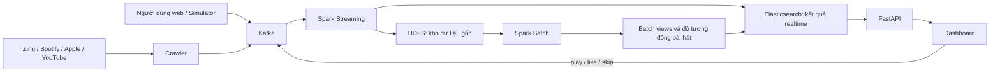

# VN Music Pulse — README kế hoạch toàn bộ dự án

Tài liệu này dành cho người mới mở project lần đầu. Hãy đọc theo thứ tự từ trên xuống trước khi đọc các tài liệu kỹ thuật trong `docs/`.

---

## 1. Dự án này làm gì?

VN Music Pulse là hệ thống Big Data thu thập dữ liệu âm nhạc từ nhiều nền tảng để trả lời hai câu hỏi:

1. Bài hát nào đang thịnh hành trên toàn quốc và được quan tâm nhiều ở từng tỉnh/thành?
2. Khi một người vừa nghe, thích hoặc bỏ qua một bài, hệ thống nên gợi ý playlist nào cho họ trong vài giây tiếp theo?

Sản phẩm cuối cùng là một dashboard web có:

- Bản đồ xu hướng âm nhạc của 34 tỉnh/thành sau sáp nhập năm 2025.
- Bảng xếp hạng hợp nhất từ Zing MP3, Spotify, Apple Music và YouTube.
- Biểu đồ thể loại, nghệ sĩ, bài đang tăng hạng và độ giống nhau giữa các nền tảng.
- Playlist gợi ý riêng cho từng người dùng.
- Màn hình theo dõi sức khỏe và tốc độ của pipeline.

> **Cách gọi chính xác:** dữ liệu công khai không cung cấp lượt nghe thật theo từng tỉnh Việt Nam. Vì vậy kết quả theo tỉnh là **mức độ quan tâm âm nhạc ước lượng**, dựa trên Google Trends, bình luận nhắc địa danh và event do người dùng của hệ thống tạo ra. Event do simulator sinh phải luôn được ghi rõ là dữ liệu giả lập.

---

## 2. Hình dung dự án như một nhà máy dữ liệu



Giải thích ngắn:

- **Crawler** giống đội nhập hàng: lấy dữ liệu mới từ các nền tảng.
- **Kafka** giống băng chuyền: nhận dữ liệu và chuyển cho các bộ phận xử lý.
- **HDFS** giống kho lưu trữ lâu dài: giữ lịch sử để có thể tính lại.
- **Spark Streaming** xử lý dữ liệu mới trong vài giây/phút.
- **Spark Batch** đọc toàn bộ lịch sử và tính các bảng thống kê chính xác hơn.
- **Elasticsearch** giữ các kết quả đã tính để API truy vấn nhanh.
- **FastAPI + dashboard** là phần người dùng nhìn thấy và tương tác.

Đây là kiến trúc **Lambda**:

- Batch layer ưu tiên độ đầy đủ và chính xác.
- Speed layer ưu tiên phản hồi nhanh.
- Serving layer kết hợp hai kết quả khi người dùng truy vấn.

---

## 3. Ví dụ một bản ghi đi qua hệ thống

Giả sử Zing báo bài `Tìm Em — Hngle` đang đứng hạng 1:

1. `crawler/src_zing.py` gọi endpoint của Zing.
2. Crawler chuẩn hóa tên bài và nghệ sĩ, tạo `track_key`.
3. Bản ghi được gửi vào Kafka topic `music.charts`.
4. Spark Streaming đọc bản ghi:
   - Ghi bản gốc xuống HDFS.
   - Cập nhật BXH realtime trong Elasticsearch.
5. Spark Batch chạy mỗi giờ:
   - Gộp bài này với bản tương ứng trên Spotify, Apple và YouTube.
   - Tính điểm phổ biến toàn quốc.
   - Kết hợp Google Trends, bình luận và event để tính điểm theo tỉnh.
6. FastAPI đọc kết quả từ Elasticsearch.
7. Dashboard hiển thị bài hát trên bản đồ và bảng xếp hạng.

Nếu người dùng bấm nghe bài đó:

1. Dashboard gửi event `play` vào FastAPI.
2. FastAPI đẩy event vào Kafka topic `music.events`.
3. Spark Streaming cập nhật lịch sử gần đây của người dùng.
4. Hệ thống lấy các bài tương tự và xu hướng tại tỉnh của người dùng.
5. Playlist mới được ghi vào Elasticsearch và xuất hiện sau vài giây.

---

## 4. Các loại dữ liệu trong hệ thống

| Kafka topic | Nội dung | Ví dụ sử dụng |
|---|---|---|
| `music.charts` | Một bài tại một vị trí trên một BXH | Tính độ phổ biến, bài tăng hạng |
| `music.playlists` | Một bài nằm trong một playlist | Học bài nào thường xuất hiện cùng nhau |
| `music.comments` | Bình luận YouTube | Tìm tín hiệu nhắc hoặc tự nhận ở một tỉnh |
| `music.trends` | Mức quan tâm Google Trends theo tỉnh cũ | Ước lượng khác biệt vùng miền |
| `music.events` | Play, skip, like của người dùng hoặc simulator | Realtime chart và gợi ý playlist |

### Nguồn dữ liệu thật và giả lập

| Loại | Dữ liệu | Có thể kết luận gì? |
|---|---|---|
| Quan sát trực tiếp | Hạng, stream, view, like, playlist | Bài nào phổ biến trên một nền tảng |
| Suy luận | Google Trends, bình luận nhắc tỉnh | Tỉnh nào có vẻ quan tâm bài nào hơn |
| First-party | Event từ người dùng dashboard | Hành vi thật trong phạm vi người dùng của hệ thống |
| Giả lập | Event từ `crawler/simulator.py` | Chỉ chứng minh kiến trúc chịu tải và recommendation hoạt động |

Không được trình bày event giả lập như dữ liệu người nghe thật ngoài đời.

---

## 5. Vai trò của từng thư mục

```text
crawler/    Lấy dữ liệu ngoài và sinh event, sau đó gửi vào Kafka
shared/     Chuẩn hóa tên bài, nghệ sĩ, thể loại và tỉnh/thành
spark/      Xử lý streaming, batch view và độ tương đồng bài hát
serving/    FastAPI, Elasticsearch setup và giao diện dashboard
k8s/        Khai báo toàn bộ dịch vụ chạy trên Kubernetes
scripts/    Deploy, bootstrap dữ liệu, kiểm thử lỗi và kiểm thử tải
local/      Công cụ chạy thử từng phần không cần Kubernetes
tests/      Unit test cho logic chuẩn hóa
docs/       Tài liệu mô tả, kiến trúc, triển khai và kiểm thử chi tiết
```

Các file nên đọc theo thứ tự:

1. `PROJECT_PLAN.md` — tài liệu bạn đang đọc.
2. `README.md` — tổng quan và lệnh chạy.
3. `docs/01-mo-ta-du-an.md` — mô tả bài toán và nguồn dữ liệu.
4. `docs/02-kien-truc.md` — công thức và thiết kế kỹ thuật.
5. `docs/03-trien-khai.md` — cách dựng hệ thống.
6. `docs/04-kiem-thu.md` — cách chứng minh chịu lỗi và mở rộng.
7. `docs/05-du-lieu-va-schema.md` — toàn bộ topic, trường dữ liệu, HDFS view và Elasticsearch index.

---

## 6. Phạm vi phiên bản cần hoàn thành

### Bắt buộc — MVP

- Crawl được ít nhất 3 nền tảng và lưu snapshot BXH.
- Kafka nhận được các topic chính.
- Spark Streaming ghi dữ liệu gốc xuống HDFS.
- Spark Batch tạo catalog bài hát và BXH hợp nhất.
- Elasticsearch phục vụ được kết quả batch và realtime.
- Dashboard hiển thị BXH toàn quốc và theo tỉnh.
- Event play/like/skip làm recommendation thay đổi.
- Có test một broker Kafka hoặc Spark driver bị lỗi rồi phục hồi.

### Nên có

- Đủ cả Zing, Spotify, Apple và YouTube.
- Google Trends theo tỉnh có retry, cache và độ phủ dữ liệu.
- Bình luận YouTube dùng API key chính thức.
- Phân tích thể loại, nghệ sĩ, bài tăng hạng và tương quan nền tảng.
- Recommendation có lý do giải thích.
- Dashboard hiển thị độ tin cậy của kết quả từng tỉnh.

### Có thể làm thêm

- MusicBrainz/ISRC để định danh bài chính xác hơn.
- Last.fm làm nguồn kiểm chứng độc lập.
- YouTube video statistics để đo tốc độ tăng view/like/comment.
- Cảnh báo khi crawler thay đổi schema hoặc trả về quá ít dữ liệu.
- Triển khai profile full trên cloud.

Không nên mở rộng sang lyrics hoặc tải file nhạc nếu không có quyền sử dụng nội dung.

---

## 7. Kế hoạch triển khai theo giai đoạn

Project đã có phần lớn code. Kế hoạch dưới đây là thứ tự **hiểu, chạy và xác minh**, không có nghĩa phải viết lại từ đầu.

### Giai đoạn 0 — Chốt bài toán và cách trình bày

Mục tiêu:

- Thống nhất tên sản phẩm: VN Music Pulse.
- Gọi kết quả theo tỉnh là “mức độ quan tâm ước lượng”.
- Tách rõ dữ liệu quan sát, suy luận và giả lập.
- Chọn 3 màn hình demo chính: bản đồ, analytics, recommendation.

Hoàn thành khi:

- Thành viên có thể giải thích dự án trong 60 giây.
- Không còn tuyên bố rằng nền tảng công khai cung cấp lượt nghe thật theo tỉnh.

### Giai đoạn 1 — Kiểm tra crawler độc lập

Việc cần làm:

- Chạy từng crawler với `--sink stdout` hoặc `--sink jsonl`.
- Kiểm tra số bản ghi, trường bị thiếu và dữ liệu trùng.
- Xác nhận Zing, Spotify, Apple và YouTube vẫn trả đúng schema.
- Đặt `YOUTUBE_API_KEY` để dùng API bình luận chính thức.
- Với Google Trends, kiểm tra retry và HTTP 429.

Lệnh mẫu:

```bash
python crawler/run_crawler.py --job charts --sink stdout
python crawler/run_crawler.py --job playlists --sink stdout
python crawler/run_crawler.py --job comments --sink stdout --since-hours 3
python crawler/run_crawler.py --job trends --sink jsonl --jsonl-dir ./out
```

Hoàn thành khi:

- Mỗi nguồn tạo được bản ghi có `track_key`, `source` và `crawled_ms`.
- Một nguồn lỗi không làm mất dữ liệu của các nguồn còn lại.
- Có ghi chú nguồn nào là API chính thức, nội bộ hoặc bên thứ ba.

### Giai đoạn 2 — Dựng hạ tầng lưu chuyển dữ liệu

Việc cần làm:

- Dựng Kubernetes namespace và ConfigMap.
- Dựng Kafka 3 broker và các topic.
- Dựng HDFS, Elasticsearch và Spark standalone.
- Dựng FastAPI để kiểm tra kết nối Elasticsearch.

Hoàn thành khi:

- Tất cả pod cần thiết ở trạng thái `Running` hoặc Job `Completed`.
- Kafka có đủ topic.
- HDFS, Elasticsearch và Spark UI truy cập được.
- `/api/health` trả về Elasticsearch hoạt động.

### Giai đoạn 3 — Hoàn thiện ingestion và master dataset

Việc cần làm:

- Cho crawler gửi dữ liệu vào Kafka.
- Chạy query `ingest` của Spark Streaming.
- Kiểm tra dữ liệu Parquet trong `/datalake/raw`.
- Xác minh restart Spark không đọc lại sai offset.

Hoàn thành khi:

- Số lượng bản ghi Kafka và HDFS khớp ở phạm vi kiểm thử.
- Dữ liệu được phân vùng theo topic và ngày.
- Restart speed layer không tạo bản ghi logic bị nhân đôi.

### Giai đoạn 4 — Xây batch views

Việc cần làm:

- Chuẩn hóa và gộp cùng một bài giữa nhiều nền tảng.
- Tạo catalog hợp nhất.
- Tính điểm phổ biến toàn quốc.
- Tính xu hướng theo tỉnh và độ tin cậy.
- Tạo các bảng analytics.
- Tạo độ tương đồng bài hát từ playlist, chart và phiên nghe.

Hoàn thành khi:

- Có document trong `music-tracks`, `music-trending-batch` và `music-item-sim`.
- Một bài có thể chứa metadata gộp từ nhiều nguồn.
- Dashboard giải thích được thành phần điểm của mỗi bài.

### Giai đoạn 5 — Xây speed layer

Việc cần làm:

- Đếm play/skip/like theo cửa sổ thời gian.
- Nhận diện tỉnh trong bình luận mới.
- Cập nhật snapshot chart mới nhất.
- Tính recommendation trong cửa sổ 30 phút của từng user.
- Duy trì checkpoint trên HDFS.

Hoàn thành khi:

- Event mới xuất hiện trong realtime view sau vài giây.
- Recommendation thay đổi sau khi người dùng play/like/skip.
- Restart Spark driver tiếp tục từ checkpoint.

### Giai đoạn 6 — API và dashboard

Ba màn hình chính:

1. **Xu hướng:** bản đồ 34 tỉnh, top bài, nguồn điểm và độ tin cậy.
2. **Phân tích:** thể loại, nghệ sĩ, bài tăng hạng, lịch sử và độ giống nhau giữa nền tảng.
3. **Dành cho bạn:** lịch sử hành vi và playlist gợi ý realtime.

Hoàn thành khi:

- Người xem hiểu màu sắc và con số biểu thị điều gì.
- Kết quả giả lập có nhãn rõ ràng.
- Trường hợp chưa có dữ liệu hiển thị thông báo thay vì lỗi trang.

### Giai đoạn 7 — Kiểm thử Big Data

Các kịch bản bắt buộc:

- Tắt một Kafka broker khi đang có dữ liệu vào.
- Restart Spark driver và kiểm tra checkpoint.
- Restart Elasticsearch/API.
- Tăng tốc độ event và số Spark worker.
- Chạy crawler nhiều shard.
- So sánh số bản ghi trước và sau sự cố.

Các chỉ số cần ghi lại:

- Records/second.
- Thời gian một micro-batch.
- Độ trễ từ Kafka đến Elasticsearch.
- Số bản ghi mất hoặc trùng.
- Thời gian phục hồi.
- Mức tăng throughput khi scale worker/API/crawler.

Hoàn thành khi:

- Có bảng kết quả đo thực tế và ảnh chụp dashboard/UI.
- Không chỉ mô tả rằng hệ thống “có khả năng” chịu lỗi hoặc mở rộng.

### Giai đoạn 8 — Báo cáo và demo

Báo cáo cần trả lời:

- Vì sao bài toán cần Big Data?
- Vì sao dùng Kafka, HDFS, Spark và Elasticsearch?
- Batch layer và speed layer đóng góp gì khác nhau?
- Dữ liệu theo tỉnh đến từ đâu và có hạn chế gì?
- Hệ thống đã được kiểm thử chịu lỗi/mở rộng như thế nào?
- Kết quả phân tích nào rút ra từ dữ liệu thật?

Hoàn thành khi:

- Demo chạy theo một kịch bản cố định dưới 10 phút.
- Có dữ liệu dự phòng nếu một nguồn bên ngoài tạm thời lỗi.
- Có slide về hạn chế dữ liệu và đạo đức sử dụng dữ liệu.

---

## 8. Lịch chạy đề xuất

| Job | Tần suất | Lý do |
|---|---:|---|
| Zing realtime | 30 phút | BXH thay đổi nhanh |
| Spotify/Kworb | 6–24 giờ | Chart chủ yếu cập nhật theo ngày |
| Apple Music | 6–24 giờ | Không cần crawl mỗi 30 phút |
| YouTube weekly charts | Mỗi ngày | Dữ liệu gốc theo tuần |
| YouTube comments | Mỗi giờ | Lấy tăng dần bình luận mới |
| Google Trends | Mỗi ngày | Dễ bị rate limit, không cần realtime |
| Batch views | Mỗi giờ | Sửa sai speed layer và cập nhật thống kê |
| Item similarity | Mỗi 3 giờ | Phép tính nặng hơn, không cần chạy liên tục |

Hiện project gom nhiều nguồn chart vào một CronJob 30 phút. Sau khi MVP chạy ổn, nên tách lịch theo từng nguồn để giảm dữ liệu lặp và tránh gọi endpoint không cần thiết.

---

## 9. Kịch bản chạy toàn bộ hệ thống

### Yêu cầu

- `kubectl` đang trỏ tới cluster Kubernetes.
- Profile lite cần khoảng 12 GB RAM trống.
- Có file `.env` nếu dùng YouTube API key.

### Triển khai

```bash
cp .env.example .env

# Điền YOUTUBE_API_KEY trong .env nếu có
./scripts/deploy.sh
./scripts/bootstrap-data.sh
```

Trên PowerShell:

```powershell
Copy-Item .env.example .env
.\scripts\run.ps1 deploy
.\scripts\run.ps1 bootstrap
```

Mở dashboard:

```bash
kubectl -n music port-forward svc/music-api 8000:80
```

Sau đó truy cập `http://localhost:8000`.

Kiểm tra nhanh:

```bash
kubectl -n music get pods
kubectl -n music get jobs
kubectl -n music logs deployment/music-api --tail=100
kubectl -n music logs deployment/speed-layer --tail=100
```

---

## 10. Kịch bản demo 8 phút

1. **Phút 0–1:** giới thiệu hai bài toán và sơ đồ kiến trúc.
2. **Phút 1–2:** cho xem dữ liệu từ bốn nền tảng đi vào Kafka.
3. **Phút 2–3:** mở HDFS/Spark UI để chứng minh dữ liệu đang được lưu và xử lý.
4. **Phút 3–5:** mở dashboard, chọn hai tỉnh và so sánh top bài cùng độ tin cậy.
5. **Phút 5–6:** mở trang analytics, chỉ ra một khác biệt giữa các nền tảng.
6. **Phút 6–7:** chọn user, bấm play/like/skip và chờ recommendation thay đổi.
7. **Phút 7–8:** trình bày kết quả test tắt broker, restart Spark và scale worker.

Nếu Google Trends hoặc một nền tảng bên ngoài lỗi trong lúc demo, dashboard vẫn dùng batch view gần nhất đã lưu trong HDFS/Elasticsearch.

---

## 11. Rủi ro và cách xử lý

| Rủi ro | Ảnh hưởng | Cách xử lý |
|---|---|---|
| Endpoint Zing/Spotify/YouTube nội bộ thay đổi | Crawler lỗi | Tách crawler theo nguồn, health check, lưu dữ liệu gần nhất |
| Google Trends trả 429 | Thiếu tín hiệu theo tỉnh | Chạy chậm, retry, cache, giữ batch gần nhất |
| Cùng bài nhưng tên khác nhau | Trùng catalog | Chuẩn hóa + alias; sau MVP thêm ISRC/MusicBrainz |
| Gộp nhầm remix/live/cover | Sai recommendation | Thêm version, duration, album và ISRC vào matching |
| Bình luận nhắc tỉnh bị hiểu sai | Xếp hạng tỉnh nhiễu | Phân loại `self`/`mention`, làm mượt, hiển thị confidence |
| Simulator bị hiểu là dữ liệu thật | Kết luận sai | Gắn `data_origin=simulated`, tách chế độ demo |
| Tràn state Spark | Streaming dừng | Watermark, cửa sổ 5 phút, RocksDB state store |
| Máy không đủ RAM | Cluster không chạy | Test từng phần local hoặc dùng cloud/profile full |
| Lưu comment có dữ liệu cá nhân | Rủi ro riêng tư | Không lưu tên/ID trực tiếp, hạn chế text, đặt retention và quyền truy cập |

---

## 12. Tiêu chí “project đã hoàn thành”

Đánh dấu project hoàn thành khi tất cả câu dưới đây trả lời được bằng bằng chứng:

- [ ] Crawler đang lấy dữ liệu thật từ ít nhất ba nền tảng.
- [ ] Kafka tiếp tục nhận dữ liệu khi một broker bị tắt.
- [ ] HDFS lưu được master dataset có thể chạy batch lại.
- [ ] Spark Batch sinh được BXH toàn quốc và theo tỉnh.
- [ ] Spark Streaming cập nhật realtime view và recommendation.
- [ ] Elasticsearch phục vụ đủ index cần thiết.
- [ ] Dashboard giải thích được nguồn và độ tin cậy của kết quả.
- [ ] Event mới làm recommendation thay đổi trong thời gian đo được.
- [ ] Có số liệu kiểm thử mất/trùng dữ liệu, throughput và recovery time.
- [ ] Báo cáo phân biệt rõ dữ liệu thật, suy luận và giả lập.
- [ ] Có kịch bản demo dự phòng khi nguồn ngoài lỗi.

---

## 13. Việc nên làm ngay tiếp theo

Thứ tự ngắn nhất để hiểu project mà không bị ngợp:

1. Chạy unit test trong `tests/`.
2. Chạy crawler `charts` với `--sink stdout` để nhìn bản ghi thật.
3. Mở `crawler/common.py` để hiểu schema chung.
4. Đọc phần luồng dữ liệu trong `docs/02-kien-truc.md`.
5. Chạy deploy và bootstrap trên cluster đủ RAM.
6. Kiểm tra lần lượt Kafka → HDFS → Elasticsearch → API, không kiểm tra tất cả cùng lúc.
7. Thực hiện một event `play` trên dashboard và theo dõi nó đi hết pipeline.
8. Sau khi luồng cơ bản hoạt động mới chạy test chịu lỗi và scalability.

Mục tiêu đầu tiên không phải làm mọi biểu đồ chạy ngay. Mục tiêu đầu tiên là chứng minh được một bản ghi đi trọn đường:

```text
Nguồn dữ liệu → Crawler → Kafka → Spark → HDFS/Elasticsearch → API → Dashboard
```

Khi luồng này chạy ổn, các nguồn dữ liệu và phân tích còn lại chỉ là mở rộng trên cùng kiến trúc.
