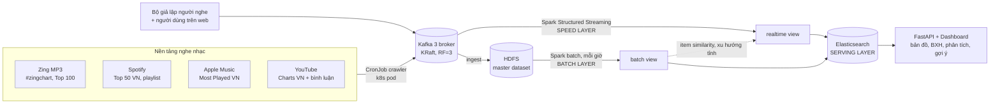

# VN Music Pulse

**Hệ thống lưu trữ và xử lý dữ liệu lớn: xu hướng âm nhạc theo 34 tỉnh/thành Việt Nam và gợi ý playlist thời gian thực**

Project môn *Big Data Storage and Processing*, **Direction 1** (xây dựng và cài đặt kiến trúc dữ liệu lớn).

Dữ liệu được crawl **trực tiếp từ các nền tảng nghe nhạc dài** (Zing MP3, Spotify, Apple Music, YouTube/YouTube Music).
Crawler chạy trong pod Kubernetes và đẩy bản ghi thẳng vào Kafka. Không có bước tải file về máy cá nhân rồi upload lại.

| Nhiệm vụ | Hệ thống làm gì |
|---|---|
| 1. Âm nhạc thịnh hành theo từng tỉnh | Bản đồ 34 tỉnh (sau sáp nhập 01/07/2025) + bảng xếp hạng từng tỉnh, gộp **batch view** (tính lại mỗi giờ) và **realtime view** (60 phút gần nhất) |
| 2. Gợi ý playlist theo thời gian thực | Mỗi lượt nghe/bỏ qua/thích → Kafka → Spark Structured Streaming → playlist mới trong vài giây, có lý do giải thích ("Vì bạn vừa nghe…") |

## Kiến trúc (Lambda)



Mọi thành phần chạy trên **Kubernetes** (minikube hoặc cloud) bằng image chính thức (`apache/kafka`,
`apache/hadoop`, `apache/spark`, `elasticsearch`, `python`). **Không build image Docker nào**: code Python/HTML được
nạp vào pod qua ConfigMap.

| Thành phần | Công nghệ | Chạy dưới dạng | Chịu lỗi / mở rộng |
|---|---|---|---|
| Thu thập | Python (requests, youtube-comment-downloader) | CronJob; crawler bình luận là Indexed Job 3 pod | Job retry; tăng số shard |
| Hàng đợi | Kafka 3.9 KRaft | StatefulSet 3 node | RF=3, min.insync=2, acks=all |
| Lưu trữ thô | HDFS 3.4 | NameNode + DataNode StatefulSet | replication=2, thêm DataNode |
| Speed layer | Spark 3.5 Structured Streaming | Deployment (1 driver) | checkpoint trên HDFS, ghi ES idempotent |
| Batch layer | Spark 3.5 | CronJob mỗi giờ / 3 giờ | chạy lại từ master dataset |
| Tính toán | Spark standalone | master (khôi phục từ PVC) + worker Deployment | scale số worker |
| Serving | Elasticsearch 8.19 | StatefulSet 1 node (lite) / 3 node (full) | replica shard (full) |
| API + dashboard | FastAPI, ECharts, Leaflet | Deployment 2 pod + HPA | HPA 2→6 pod theo CPU |

## "Theo tỉnh" lấy từ đâu? (đọc kỹ để trình bày cho đúng)

Không nền tảng nghe nhạc nào công bố BXH theo tỉnh của Việt Nam. Đã kiểm tra: Shazam chỉ có Top 200 toàn quốc,
Apple Music City Charts không có thành phố VN, số liệu theo thành phố của YouTube/Spotify chỉ chủ kênh/nghệ sĩ mới xem được.
Hệ thống ghép 4 tín hiệu, mỗi tín hiệu ghi rõ nguồn:

| Tín hiệu | Nguồn | Thật/giả lập | Trọng số |
|---|---|---|---|
| **Toàn quốc** N | điểm hạng trên BXH Zing, Spotify, Apple Music, YouTube | thật | 0.35 |
| **Google Trends** G | lượt **tìm bài hát trên YouTube** theo từng tỉnh (63 tỉnh cũ, gộp về 34 tỉnh mới theo dân số) | thật | 0.35 |
| **Bình luận** C | bình luận YouTube nhắc tên tỉnh, mỗi người tính 1 lần/bài | thật | 0.15 |
| **Lượt nghe** E | người nghe giả lập + người dùng trên dashboard | giả lập | 0.15 |

- **Google Trends là tín hiệu chính.** Giá trị là tỉ lệ lượt tìm của bài trong tỉnh so với tổng lượt tìm của tỉnh, nên tỉnh
  đông dân không lấn át tỉnh nhỏ. Mỗi lần tra so 5 từ khoá: 1 **bài mốc** + 4 bài. Bài mốc được chọn tự động là bài có số liệu
  ở nhiều tỉnh nhất, nhờ đó mọi bài quy về cùng một thang. Crawler chạy chậm (45 giây/nhóm) để Google không chặn.
- **Bình luận được siết chặt:**
  - "Ai ở Nghệ An điểm danh", "quê mình Trà Vinh" là **tự nhận ở tỉnh** (trọng số 1); "Hà Nội mùa thu đẹp quá" chỉ là **nhắc tên** (0.3).
  - Bỏ bình luận kiểu credit/lời bài hát, và bỏ tên tỉnh có trong chính tên bài (bài "Sài Gòn Đau Lòng Quá").
  - Mỗi người viết chỉ tính 1 lần nhờ mã băm ẩn danh. Không lưu tên hay ID người viết.
- **Chỉ tính tín hiệu mà tỉnh có đủ dữ liệu:** `score = Σ wᵢ·sᵢ·aᵢ / Σ wᵢ·aᵢ`, với `aᵢ = 1` khi tỉnh đủ dữ liệu cho tín hiệu i.
- **Độ tin cậy từng tỉnh** chỉ tính từ tín hiệu thật (Trends 70%, bình luận 30%), hiển thị trên dashboard. Tỉnh "thấp" được ghi rõ
  là xếp hạng chủ yếu dựa trên toàn quốc.
- **Kiểm chứng chéo:** bảng tương quan Spearman trong từng tỉnh giữa Trends ↔ bình luận (hai nguồn thật độc lập) và
  Trends ↔ toàn quốc (tỉnh có gu khác cả nước).

## Cấu trúc thư mục

```
crawler/        crawler từng nền tảng (src_*.py), run_crawler.py, simulator.py   -> Kafka
spark/          speed_layer.py (streaming), batch_views.py, batch_similarity.py, submit.sh
serving/        api.py (FastAPI), es_setup.py, static/ (dashboard HTML/JS/CSS)
shared/         provinces.py (34 tỉnh + alias tỉnh cũ), textnorm.py (chuẩn hoá tên bài, nhận diện tỉnh, thể loại)
k8s/            manifest Kubernetes (đánh số theo thứ tự triển khai), profiles/full, optional/kibana
scripts/        deploy, update-code, bootstrap-data, test-fault-tolerance, test-scalability, loadtest
local/          công cụ test cục bộ không cần k8s (nạp JSONL vào data lake, nạp output Spark vào ES)
tests/          unit test cho chuẩn hoá & nhận diện tỉnh
docs/           mô tả dự án, kiến trúc, triển khai, kiểm thử
```

## Chạy nhanh

Yêu cầu: `kubectl` và một cluster Kubernetes. Profile **lite** cần khoảng **12 GB RAM trống** cho cluster (minikube).
Máy 8 GB RAM không đủ, hãy dùng cloud (GKE/AKS, xem `docs/03-trien-khai.md`).

```bash
# Windows: chạy trong Git Bash, hoặc PowerShell: .\scripts\run.ps1 deploy
minikube start --cpus 6 --memory 12g --nodes 1          # hoặc cluster cloud
minikube addons enable metrics-server                     # cho HPA
cp .env.example .env                                      # (tuỳ chọn) điền YOUTUBE_API_KEY

./scripts/deploy.sh                 # dựng Kafka, HDFS, ES, Spark, crawler, API (~10-15 phút lần đầu vì kéo image)
./scripts/bootstrap-data.sh         # crawl lần đầu + backfill + batch view đầu tiên
minikube service -n music music-api # mở dashboard
```

Kiểm thử theo đúng yêu cầu đề bài:

```bash
./scripts/test-fault-tolerance.sh   # tắt broker Kafka, DataNode, Spark worker/driver/master, ES, API -> xem tự phục hồi
./scripts/test-scalability.sh       # tăng tải x3, thêm worker/core, crawl song song 3->6 pod, HPA API, thêm DataNode
```

## Đã kiểm chứng những gì

Máy phát triển (8 GB RAM, ổ C gần đầy) không chạy nổi cả cụm k8s, nên việc kiểm chứng chia làm 3 lớp:

- **Crawler: chạy thật** với 4 nền tảng + Google Trends. Một lượt crawl BXH được 846 bản ghi, playlist 3.390 bản ghi,
  bình luận 13.755. Google Trends: 28 bài × 63 tỉnh trong 6,5 phút; bị 429 một lần và crawler tự chờ rồi chạy tiếp.
  Bài mốc tự chọn có số liệu ở 54/63 tỉnh.
- **Spark job: chạy thật** ở local mode (PySpark 3.5.9, Java 17) trên dữ liệu thật: `batch_views`, `batch_similarity`, và
  `speed_layer` đọc từ **Kafka 3.9.2 thật**. Cả 5 streaming query đều ra kết quả; playlist gợi ý được tính lại mỗi micro-batch (trigger 5 giây).
- **Spark → Elasticsearch qua connector: chạy thật.** `batch_views` và `batch_similarity` ghi thẳng vào ES 8.19.22, kể cả
  bước xoá bản cũ theo `run_id`. Lần test này phát hiện connector **8.19.14 trở lên có POM lỗi** (trỏ tới artifact không có trên
  Maven Central), nên dự án dùng 8.19.13.
- **API + dashboard: chạy thật** với Elasticsearch 8.19.22, kiểm tra từng tab trên Chrome ở cả giao diện sáng và tối.
- **Manifest k8s**: 43 resource hợp lệ theo schema Kubernetes 1.31 (`kubeconform -strict`). **Chưa chạy trên một cụm k8s
  thật.** Lần deploy đầu có thể phải chỉnh nhỏ (xem mục "Sự cố thường gặp" trong `docs/03-trien-khai.md`).
- **Test chịu lỗi & mở rộng: chạy thật ở mức cục bộ** với cụm Kafka 3 broker, Spark, ES (xem `docs/04-kiem-thu.md` mục 4):
  - Tắt 1 broker khi đang có tải: 0 lỗi ghi. Driver Spark chết thì chạy tiếp từ checkpoint.
  - **Không mất, không trùng:** tổng Kafka = tổng ES (3.433 = 3.433; 101.051 = 101.051).
  - Test tải ×15 đã phát hiện và sửa một lỗi tràn bộ nhớ ở luồng gợi ý.
  - Crawl song song nhanh gấp 2,7 lần; API 3 worker gấp 2,2 lần.
  - Các kịch bản riêng của k8s (HDFS DataNode, Spark worker/master, ES nhiều node, HPA) vẫn cần cụm thật.

## Tài liệu

- [docs/01-mo-ta-du-an.md](docs/01-mo-ta-du-an.md): mô tả dự án theo mẫu nộp (nguồn dữ liệu, yêu cầu, ước lượng dung lượng, phân tích)
- [docs/02-kien-truc.md](docs/02-kien-truc.md): thiết kế chi tiết: topic, schema, công thức, thuật toán gợi ý, index ES
- [docs/03-trien-khai.md](docs/03-trien-khai.md): triển khai trên minikube (Windows) và GKE, sự cố thường gặp
- [docs/04-kiem-thu.md](docs/04-kiem-thu.md): kịch bản kiểm thử chịu lỗi và mở rộng, kết quả mong đợi
