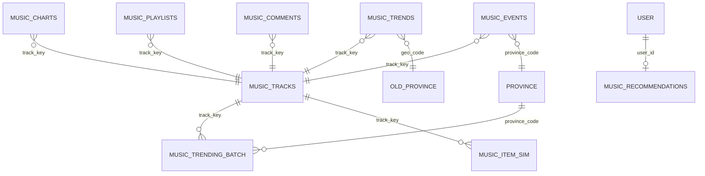

# Dữ liệu và schema của VN Music Pulse

Tài liệu này mô tả hình dạng dữ liệu từ lúc crawler tạo bản ghi cho đến khi Spark biến nó thành các bảng phục vụ dashboard.

## 1. Trước tiên: dữ liệu có phải là “bảng” không?

Tùy vị trí trong pipeline, cùng một dữ liệu có hình dạng khác nhau:

| Vị trí | Hình dạng | Cách hiểu gần giống SQL |
|---|---|---|
| Crawler | Python `dict` | Một row đang được tạo |
| Kafka | JSON message trong một topic | Topic gần giống một bảng append-only |
| HDFS raw | File Parquet, chia theo `topic` và `dt` | Một bảng master chứa JSON gốc |
| Spark | DataFrame có schema | Bảng tạm dùng để join/group/window |
| HDFS view | File Parquet đã xử lý | Materialized view có phiên bản |
| Elasticsearch | JSON document trong index | Index gần giống bảng phục vụ truy vấn |

Kafka và Elasticsearch không phải cơ sở dữ liệu quan hệ, nên không có khóa ngoại hay ràng buộc SQL. Quan hệ giữa các bản ghi được nối bằng các khóa như `track_key`, `user_id`, `province_code`, `snapshot_id`.

---

## 2. Quy ước kiểu dữ liệu

| Ký hiệu trong tài liệu | Kiểu Spark/Python | Ví dụ |
|---|---|---|
| `string` | chuỗi | `"Tìm Em"` |
| `int` | số nguyên 32-bit | `1` |
| `long` | số nguyên 64-bit | `1791212400000` |
| `double` | số thực | `0.825` |
| `boolean` | đúng/sai | `true` |
| `array<string>` | danh sách chuỗi | `["Hngle", "Bảo Anh"]` |
| `object` | cấu trúc lồng | `{"source":"spotify","platform_id":"abc"}` |
| `array<object>` | danh sách cấu trúc | danh sách bài gợi ý |

Các trường thời gian có hậu tố `_ms` là Unix epoch millisecond. Ví dụ:

```text
1791212400000 → thời điểm tuyệt đối, đơn vị millisecond
```

Các trường có thể không tồn tại ở một nguồn sẽ được lưu là `null`.

---

## 3. Các khóa quan trọng

| Khóa | Ý nghĩa | Ví dụ |
|---|---|---|
| `track_key` | Khóa bài hát đã chuẩn hóa | `tim-em__hngle` |
| `platform_id` | ID bài/video trên nền tảng nguồn | Spotify track ID hoặc YouTube video ID |
| `chart_id` | Tên một bảng xếp hạng | `zing_realtime` |
| `snapshot_id` | Một lần chụp dữ liệu theo khung thời gian | `zing_realtime@2026-10-06T01:00:00Z` |
| `playlist_id` | ID playlist có kèm tên nguồn | `spotify:37i9d...` |
| `comment_id` | ID bình luận YouTube | ID do YouTube cung cấp |
| `event_id` | UUID duy nhất của hành vi người dùng | `1eac...` |
| `user_id` | ID người dùng web hoặc simulator | `sim0-0001` |
| `province_code` | Mã một trong 34 tỉnh/thành mới | `VN-HN` |
| `geo_code` | Mã ISO của tỉnh cũ do Google Trends trả về | `VN-57` |
| `run_id` | ID một lần chạy Spark Batch | `20261006013025` |
| `doc_id` | ID document do Spark tạo để ghi đè idempotent | `VN-HN|tim-em__hngle|202610060130` |

### `track_key` được tạo như thế nào?

Crawler chuẩn hóa tên bài và nghệ sĩ chính:

```text
title   = "Tìm Em (feat. Bảo Anh)"
artist  = "Hngle"
                    ↓
track_key = "tim-em__hngle"
```

`track_key` là khóa kỹ thuật, không phải mã phát hành chính thức như ISRC. Batch layer có thêm bước gộp alias khi cùng tên bài và có nghệ sĩ trùng/khớp gần đúng.

---

# PHẦN A — DỮ LIỆU CRAWLER GỬI VÀO KAFKA

## 4. Các trường bài hát dùng chung

Hai topic `music.charts` và `music.playlists` cùng chứa nhóm trường bài hát sau:

| Trường | Kiểu | Bắt buộc | Ý nghĩa |
|---|---|---:|---|
| `track_key` | string | Có | Khóa bài đã chuẩn hóa |
| `title` | string | Có | Tên bài đã làm sạch |
| `raw_title` | string | Không | Tên nguyên bản từ nguồn |
| `artists` | array<string> | Có | Danh sách nghệ sĩ |
| `source` | string | Có | `zing`, `spotify`, `apple_music`, `youtube` |
| `platform_id` | string | Không | ID trên nền tảng nguồn |
| `url` | string | Không | URL bài hát/video |
| `thumbnail` | string | Không | URL ảnh bìa/thumbnail |
| `duration_s` | int | Không | Thời lượng bài, đơn vị giây |
| `genres` | array<string> | Không | Thể loại thô từ nguồn |
| `release_date` | string | Không | Ngày phát hành dạng `YYYY-MM-DD` nếu có |
| `album` | string | Không | Tên album nếu nguồn cung cấp |

Không phải nền tảng nào cũng có đủ các trường:

- Spotify embed có thời lượng nhưng thường không có thể loại.
- Apple có thể loại và ngày phát hành nhưng không có số stream.
- Zing có thể có lượt nghe, lượt thích và album.
- YouTube Charts có weekly views và video ID.

## 5. Topic `music.charts`

Một bản ghi `chart_entry` tương ứng với **một bài tại một vị trí trong một bảng xếp hạng tại một snapshot**.

### Schema

| Trường | Kiểu | Bắt buộc | Ý nghĩa |
|---|---|---:|---|
| `record_type` | string | Có | Thường là `chart_entry`; YouTube artist dùng `artist_entry` |
| `chart_id` | string | Có | ID bảng xếp hạng |
| `chart_scope` | string | Có | `VN` hoặc mã tỉnh với YouTube geo search |
| `snapshot_id` | string | Với chart entry | ID snapshot đã làm tròn theo thời gian |
| `crawled_ms` | long | Có | Thời điểm crawler lấy dữ liệu |
| `rank` | int | Có | Thứ hạng hiện tại |
| `chart_size` | int | Có | Tổng số dòng trong chart |
| `previous_rank` | int | Không | Hạng kỳ trước; `null` nếu nguồn không cung cấp |
| `metric_name` | string | Không | Tên chỉ số: `score`, `streams`, `weekly_views`, `view_count` (YouTube fallback) |
| `metric_value` | double | Không | Giá trị của `metric_name` |
| `total_plays` | long | Không | Tổng lượt nghe nếu nguồn cung cấp |
| `total_likes` | long | Không | Tổng lượt thích nếu nguồn cung cấp |
| Nhóm trường bài hát | nhiều kiểu | Tùy nguồn | Xem mục 4 |

### Các `chart_id` hiện có

| `chart_id` | Nguồn | Nội dung |
|---|---|---|
| `zing_realtime` | Zing | #zingchart realtime |
| `zing_week_vn` | Zing | BXH tuần Việt Nam |
| `zing_new_release` | Zing | Nhạc mới phát hành |
| `spotify_top50_vn_daily` | Spotify | Top 50 Việt Nam |
| `spotify_top_songs_vn_weekly` | Spotify | Top Songs Việt Nam theo tuần |
| `spotify_daily_streams_vn` | Kworb/Spotify | Hạng và số stream theo ngày |
| `apple_most_played_vn` | Apple Music | Top 100 Most Played Việt Nam |
| `youtube_top_songs_vn_weekly` | YouTube | Top bài hát theo tuần |
| `youtube_top_videos_vn_weekly` | YouTube | Top video âm nhạc theo tuần |
| `youtube_top_artists_vn_weekly` | YouTube | Top nghệ sĩ theo tuần |
| `youtube_most_popular_music_vn` | YouTube Data API | Fallback top video Music phổ biến tại VN khi YouTube Charts web bị 429; không đồng nghĩa BXH tuần |
| `youtube_geo_search` | YouTube Data API | Video âm nhạc có metadata vị trí gần tỉnh |

### Ví dụ `chart_entry`

```json
{
  "record_type": "chart_entry",
  "chart_id": "youtube_top_songs_vn_weekly",
  "chart_scope": "VN",
  "snapshot_id": "youtube_top_songs_vn_weekly@2026-10-06T01:00:00Z",
  "crawled_ms": 1791230400000,
  "rank": 1,
  "chart_size": 100,
  "previous_rank": 3,
  "metric_name": "weekly_views",
  "metric_value": 2692854.0,
  "total_plays": null,
  "total_likes": null,
  "track_key": "xuong-rong-intro__dangrangto",
  "title": "xương rồng (intro)",
  "raw_title": "xương rồng (intro)",
  "artists": ["Dangrangto", "DONAL"],
  "source": "youtube",
  "platform_id": "VIDEO_ID",
  "url": "https://www.youtube.com/watch?v=VIDEO_ID",
  "thumbnail": "https://...",
  "duration_s": null,
  "genres": [],
  "release_date": "2026-06-20",
  "album": null
}
```

### Bản ghi `artist_entry`

YouTube Top Artists cũng nằm trong `music.charts`, nhưng đây không phải bài hát:

```json
{
  "record_type": "artist_entry",
  "chart_id": "youtube_top_artists_vn_weekly",
  "chart_scope": "VN",
  "crawled_ms": 1791230400000,
  "rank": 1,
  "chart_size": 100,
  "previous_rank": 2,
  "metric_name": "weekly_views",
  "metric_value": 12500000.0,
  "title": "Tên nghệ sĩ",
  "artists": ["Tên nghệ sĩ"],
  "source": "youtube",
  "platform_id": "YOUTUBE_CHANNEL_ID",
  "track_key": null
}
```

Batch catalog chỉ sử dụng `record_type = chart_entry` và `track_key` khác `null`.

### Khóa khử trùng ở batch

```text
(record_type, chart_id, chart_scope, snapshot_id, rank)
```

---

## 6. Topic `music.playlists`

Một bản ghi tương ứng với **một bài tại một vị trí trong một playlist tại một snapshot**.

### Schema

| Trường | Kiểu | Bắt buộc | Ý nghĩa |
|---|---|---:|---|
| `record_type` | string | Có | `playlist_item` |
| `playlist_id` | string | Có | ID playlist có namespace nguồn |
| `playlist_name` | string | Có | Tên playlist |
| `genre_hint` | string | Không | Nhóm thể loại suy ra từ tên playlist |
| `snapshot_id` | string | Có | Snapshot playlist, mặc định gom theo 6 giờ |
| `crawled_ms` | long | Có | Thời điểm crawl |
| `position` | int | Có | Vị trí bài trong playlist |
| Nhóm trường bài hát | nhiều kiểu | Tùy nguồn | Xem mục 4 |

### Ví dụ

```json
{
  "record_type": "playlist_item",
  "playlist_id": "spotify:37i9dQZF1DX0F4i7Q9pshJ",
  "playlist_name": "Hot Hits Vietnam",
  "genre_hint": null,
  "snapshot_id": "spotify:37i9dQZF1DX0F4i7Q9pshJ@2026-10-06T00:00:00Z",
  "crawled_ms": 1791230400000,
  "position": 1,
  "track_key": "tim-em__hngle",
  "title": "Tìm Em",
  "raw_title": "Tìm Em (feat. Bảo Anh)",
  "artists": ["Hngle", "Bảo Anh"],
  "source": "spotify",
  "platform_id": "SPOTIFY_TRACK_ID",
  "url": "https://open.spotify.com/track/SPOTIFY_TRACK_ID",
  "thumbnail": null,
  "duration_s": 215,
  "genres": [],
  "release_date": null,
  "album": null
}
```

Playlist được dùng để:

- Bổ sung thể loại cho bài hát.
- Tạo “giỏ” đồng xuất hiện cho thuật toán item similarity.

### Khóa khử trùng ở batch

```text
(playlist_id, snapshot_id, position)
```

---

## 7. Topic `music.comments`

Một bản ghi tương ứng với **một bình luận YouTube gắn với một bài hát**.

### Schema

| Trường | Kiểu | Bắt buộc | Ý nghĩa |
|---|---|---:|---|
| `record_type` | string | Có | `comment` |
| `source` | string | Có | `youtube` |
| `video_id` | string | Có | YouTube video ID |
| `crawled_ms` | long | Có | Thời điểm crawler lấy bình luận |
| `track_key` | string | Có | Bài hát mà video đại diện |
| `title` | string | Có | Tên bài đã chuẩn hóa |
| `artists` | array<string> | Có | Nghệ sĩ |
| `comment_sort` | string | Có | `recent` hoặc `popular` |
| `comment_id` | string | Có | ID bình luận |
| `text` | string | Có | Nội dung bình luận |
| `like_count` | long | Không | Số lượt thích bình luận |
| `published_ms` | long | Không | Thời gian bình luận được đăng |
| `is_reply` | boolean | Có | Có phải reply hay không |
| `author_hash` | string | Không | Hash rút gọn của channel ID, không lưu tên người viết |

### Ví dụ

```json
{
  "record_type": "comment",
  "source": "youtube",
  "video_id": "VIDEO_ID",
  "crawled_ms": 1791230400000,
  "track_key": "tim-em__hngle",
  "title": "Tìm Em",
  "artists": ["Hngle", "Bảo Anh"],
  "comment_sort": "recent",
  "comment_id": "COMMENT_ID",
  "text": "Ai ở Nghệ An nghe bài này không?",
  "like_count": 12,
  "published_ms": 1791229000000,
  "is_reply": false,
  "author_hash": "e4d24a6f85c78a91"
}
```

### Khóa khử trùng ở batch

```text
comment_id
```

Nếu cùng bình luận được crawl nhiều lần, batch giữ bản có `crawled_ms` mới nhất.

---

## 8. Topic `music.trends`

Một bản ghi tương ứng với **một bài × một tỉnh cũ × một lần truy vấn Google Trends**.

### Schema

| Trường | Kiểu | Bắt buộc | Ý nghĩa |
|---|---|---:|---|
| `record_type` | string | Có | `trends_geo` |
| `source` | string | Có | `google_trends` |
| `snapshot_id` | string | Có | Ví dụ `trends@2026-10-06` |
| `crawled_ms` | long | Có | Thời điểm crawl |
| `timeframe` | string | Có | Mặc định `now 7-d` |
| `property` | string | Có | `youtube` hoặc `web` |
| `group_id` | int | Có | Nhóm so sánh; mỗi nhóm gồm một bài mốc và tối đa bốn bài |
| `anchor_key` | string | Có | `track_key` của bài mốc |
| `anchor_query` | string | Có | Từ khóa của bài mốc |
| `track_key` | string | Có | Bài đang được đo |
| `title` | string | Có | Tên bài |
| `artists` | array<string> | Có | Nghệ sĩ |
| `query` | string | Có | Từ khóa gửi lên Trends |
| `geo_code` | string | Có | Mã tỉnh cũ, ví dụ `VN-57` |
| `geo_name` | string | Có | Tên tỉnh cũ |
| `share` | int | Có | Tỷ lệ tương đối của bài trong nhóm từ khóa |
| `has_data` | boolean | Có | Tỉnh có đủ dữ liệu cho bài hay không |
| `anchor_share` | int | Có | Tỷ lệ của bài mốc trong cùng tỉnh/nhóm |
| `anchor_has_data` | boolean | Có | Tỉnh có đủ dữ liệu cho bài mốc hay không |
| `is_anchor` | boolean | Có | Bản ghi này có phải bài mốc không |

### Ví dụ

```json
{
  "record_type": "trends_geo",
  "source": "google_trends",
  "snapshot_id": "trends@2026-10-06",
  "crawled_ms": 1791230400000,
  "timeframe": "now 7-d",
  "property": "youtube",
  "group_id": 2,
  "anchor_key": "bai-moc__nghe-si",
  "anchor_query": "bài mốc nghệ sĩ",
  "track_key": "tim-em__hngle",
  "title": "Tìm Em",
  "artists": ["Hngle", "Bảo Anh"],
  "query": "tìm em hngle",
  "geo_code": "VN-57",
  "geo_name": "Bình Dương",
  "share": 64,
  "has_data": true,
  "anchor_share": 40,
  "anchor_has_data": true,
  "is_anchor": false
}
```

Giá trị dùng cho phân tích không phải `share` trực tiếp mà là:

```text
ratio = share / anchor_share
```

Sau đó Spark gộp 63 tỉnh cũ về 34 tỉnh mới theo trọng số dân số.

### Khóa khử trùng ở batch

```text
(snapshot_id, group_id, track_key, geo_code)
```

---

## 9. Topic `music.events`

Topic này không phải dữ liệu crawl từ nền tảng. Nó chứa hành vi từ dashboard hoặc simulator.

Một bản ghi tương ứng với **một hành động play, skip hoặc like**.

### Schema

| Trường | Kiểu | Bắt buộc | Ý nghĩa |
|---|---|---:|---|
| `event_id` | string | Có | UUID duy nhất |
| `user_id` | string | Có | ID user web hoặc simulator |
| `province_code` | string | Có | Tỉnh hiện tại của user |
| `track_key` | string | Có | Bài được tương tác |
| `title` | string | Có | Tên bài |
| `artists` | array<string> | Có | Nghệ sĩ |
| `genre` | string | Có | Thể loại chuẩn hóa |
| `duration_ms` | long | Có | Thời lượng toàn bài |
| `source` | string | Có | `web` hoặc `simulator` |
| `action` | string | Có | `play`, `skip`, `like` |
| `listen_ms` | long | Có | Thời gian đã nghe |
| `ts_ms` | long | Có | Thời điểm hành động xảy ra |

### Ví dụ

```json
{
  "event_id": "5f53b4ee-6ff7-4adb-850a-36d77c888e02",
  "user_id": "sim0-0001",
  "province_code": "VN-HN",
  "track_key": "tim-em__hngle",
  "title": "Tìm Em",
  "artists": ["Hngle", "Bảo Anh"],
  "genre": "V-Pop",
  "duration_ms": 215000,
  "source": "simulator",
  "action": "play",
  "listen_ms": 201300,
  "ts_ms": 1791230400000
}
```

### Khóa khử trùng ở batch

```text
event_id
```

Khi phân tích dữ liệu thật, phải lọc hoặc gắn nhãn rõ `source = simulator`.

---

# PHẦN B — DỮ LIỆU RAW TRONG HDFS

## 10. Bảng master dataset

Spark query `ingest` đọc tất cả topic Kafka và ghi một bảng Parquet append-only vào:

```text
/datalake/raw/topic=<tên-topic>/dt=<YYYY-MM-DD>/*.parquet
```

### Schema vật lý trong Parquet

| Trường | Kiểu | Ý nghĩa |
|---|---|---|
| `topic` | string | Topic Kafka; đồng thời là partition directory |
| `key` | string | Kafka message key |
| `value` | string | Toàn bộ JSON do crawler tạo, chưa parse |
| `kafka_ts` | timestamp | Timestamp Kafka gắn cho message |
| `partition` | int | Kafka partition |
| `offset` | long | Offset trong partition |
| `dt` | string | Ngày `YYYY-MM-DD`; đồng thời là partition directory |

Ví dụ đường dẫn:

```text
/datalake/raw/topic=music.charts/dt=2026-10-06/part-00000-....snappy.parquet
```

Ví dụ một row logic:

```json
{
  "topic": "music.charts",
  "key": "tim-em__hngle",
  "value": "{\"record_type\":\"chart_entry\", ...}",
  "kafka_ts": "2026-10-06T01:20:03+07:00",
  "partition": 2,
  "offset": 15428,
  "dt": "2026-10-06"
}
```

Spark Batch đọc bảng raw, chọn một topic rồi dùng `from_json(value, schema)` để biến JSON thành DataFrame có cột thật.

---

# PHẦN C — CÁC VIEW PARQUET TRONG HDFS

## 11. `catalog`

Đường dẫn:

```text
/views/catalog/run_id=<run_id>/
```

| Trường | Kiểu | Ý nghĩa |
|---|---|---|
| `track_key` | string | Khóa canonical |
| `title` | string | Tên bài đại diện |
| `artists` | array<string> | Nghệ sĩ đại diện |
| `genre` | string | Thể loại chuẩn hóa |
| `thumbnail` | string | Ảnh đại diện |
| `national_score` | double | Điểm phổ biến toàn quốc, chuẩn hóa 0–1 |

View này được speed layer và simulator đọc lại.

## 12. `track_alias`

| Trường | Kiểu | Ý nghĩa |
|---|---|---|
| `alias_key` | string | `track_key` trước khi gộp |
| `canonical_key` | string | `track_key` sau khi gộp |

Ví dụ:

```text
laviem__quang-hung-masterd → laviem__tinh-ha-say-hi
```

## 13. `trending_batch`

| Trường | Kiểu | Ý nghĩa |
|---|---|---|
| `province_code` | string | Tỉnh/thành |
| `track_key` | string | Bài hát |
| `score` | double | Điểm tổng hợp batch |
| `score_norm` | double | Điểm chia cho điểm cao nhất của tỉnh |

Speed layer đọc view này để cộng xu hướng tỉnh vào recommendation.

## 14. `item_sim`

| Trường | Kiểu | Ý nghĩa |
|---|---|---|
| `track_key` | string | Bài gốc |
| `neighbor_key` | string | Bài tương tự |
| `sim` | double | Điểm tương đồng |

Mỗi bài giữ tối đa 30 hàng xóm gần nhất trước khi được gom thành document Elasticsearch.

---

# PHẦN D — CÁC INDEX TRONG ELASTICSEARCH

## 15. Nhóm realtime

### 15.1 `music-rt-plays`

Một document = một tỉnh × một bài × một phút.

| Trường | Kiểu | Ý nghĩa |
|---|---|---|
| `doc_id` | string | `province|track|yyyyMMddHHmm` |
| `minute` | date/long | Đầu phút |
| `province_code` | string | Tỉnh |
| `track_key` | string | Bài |
| `title` | string | Tên bài |
| `artists` | array<string> | Nghệ sĩ |
| `genre` | string | Thể loại |
| `plays` | long | Số event play |
| `skips` | long | Số event skip |
| `likes` | long | Số event like |
| `listeners` | long | Số user gần đúng không trùng |
| `last_ts_ms` | date/long | Event mới nhất trong cửa sổ |

### 15.2 `music-rt-mentions`

Một document = một bình luận × một tỉnh được nhận diện.

| Trường | Kiểu | Ý nghĩa |
|---|---|---|
| `doc_id` | string | `comment_id|province_code` |
| `province_code` | string | Tỉnh được nhắc |
| `track_key` | string | Bài hát |
| `title` | string | Tên bài |
| `artists` | array<string> | Nghệ sĩ |
| `video_id` | string | YouTube video ID |
| `comment_id` | string | ID bình luận |
| `kind` | string | `self` hoặc `mention` |
| `weight` | double | `1.0` hoặc `0.3` |
| `author_hash` | string | Mã người viết đã hash |
| `text` | text | Tối đa 300 ký tự |
| `like_count` | long | Lượt thích bình luận |
| `published_ms` | date/long | Thời gian đăng |
| `crawled_ms` | date/long | Thời gian crawl |

### 15.3 `music-rt-charts`

Một document = một hạng trong snapshot chart mới nhất.

ID document:

```text
chart_id|chart_scope|rank
```

Các trường gần giống toàn bộ schema `music.charts`, cộng thêm `doc_id` và bỏ `raw_title`.

### 15.4 `music-recommendations`

Một document = playlist hiện tại của một user. Document ID là `user_id`.

| Trường | Kiểu | Ý nghĩa |
|---|---|---|
| `user_id` | string | User nhận gợi ý |
| `province_code` | string | Tỉnh gần nhất của user |
| `tracks` | array<object> | Tối đa 20 bài gợi ý |
| `based_on` | array<object> | Tối đa 5 hành vi gần nhất |
| `events_30m` | long | Số event trong cửa sổ 30 phút |
| `updated_at` | date/long | Thời gian tính gợi ý |
| `batch_id` | long | ID micro-batch Spark |

Mỗi phần tử trong `tracks`:

| Trường | Kiểu | Ý nghĩa |
|---|---|---|
| `rank` | int | Hạng trong playlist |
| `track_key` | string | Bài được gợi ý |
| `title` | string | Tên bài |
| `artists` | array<string> | Nghệ sĩ |
| `genre` | string | Thể loại |
| `thumbnail` | string | Ảnh |
| `score` | double | Điểm cuối |
| `cf` | double | Điểm từ bài tương tự/lịch sử nghe |
| `trend` | double | Điểm xu hướng tỉnh |
| `reason` | string | Lý do gợi ý |

Mỗi phần tử trong `based_on`:

```text
r, track_key, title, action
```

### 15.5 `music-metrics` và `music-metrics-history`

| Trường | Kiểu | Ý nghĩa |
|---|---|---|
| `query` | string | Tên streaming query |
| `batch_id` | long | Micro-batch ID |
| `input_rows` | long | Số dòng đầu vào |
| `input_rps` | double | Tốc độ đầu vào |
| `processed_rps` | double | Tốc độ xử lý |
| `duration_ms` | long | Thời gian trigger |
| `ts_ms` | date/long | Thời gian ghi metric |

`music-metrics` giữ trạng thái mới nhất theo query; `music-metrics-history` giữ lịch sử theo `query|batch_id`.

---

## 16. Nhóm batch chính

### 16.1 `music-tracks`

Một document = một bài hát canonical. Document ID là `track_key`.

| Trường | Kiểu | Ý nghĩa |
|---|---|---|
| `track_key` | string | Khóa canonical |
| `title` | string | Tên bài đại diện mới nhất |
| `artists` | array<string> | Danh sách nghệ sĩ đại diện |
| `genres` | array<string> | Tất cả thể loại thô đã gộp |
| `genre` | string | Thể loại chuẩn hóa dùng cho dashboard |
| `sources` | array<string> | Các nền tảng có bài này |
| `links` | array<object> | `source`, `platform_id`, `url` của từng nguồn |
| `thumbnail` | string | Ảnh đại diện |
| `duration_s` | int | Thời lượng |
| `release_date` | string | Ngày phát hành sớm nhất biết được |
| `first_seen_ms` | date/long | Lần đầu crawler thấy bài |
| `last_seen_ms` | date/long | Lần gần nhất crawler thấy bài |
| `national_score` | double | Điểm toàn quốc chuẩn hóa 0–1 |
| `n_platforms` | long | Số nền tảng chứa bài trong chart mới nhất |
| `chart_ranks` | array<object> | Danh sách `chart_id`, `rank`, `metric_value` |
| `rank_gain` | double | Tổng điểm tăng hạng có trọng số |
| `search_text` | string | Tên bài + nghệ sĩ đã chuẩn hóa để tìm kiếm |
| `run_id` | string | Batch tạo document |

### 16.2 `music-trending-batch`

Một document = một hạng trong top 50 của một tỉnh. ID là `province_code|rank`.

| Nhóm | Trường |
|---|---|
| Định danh | `doc_id`, `run_id`, `run_ts`, `province_code`, `province_name`, `region`, `rank` |
| Bài hát | `track_key`, `title`, `artists`, `genre`, `thumbnail`, `sources` |
| Điểm chính | `score`, `national`, `trends`, `comment_affinity`, `event_affinity` |
| Phần đóng góp | `c_nat`, `c_trd`, `c_cmt`, `c_evt` |
| Google Trends | `trend_ratio`, `trend_lift` |
| Bình luận | `mentions`, `mention_authors`, `self_mentions`, `comment_lift` |
| Event | `plays`, `play_lift` |
| Độ tin cậy | `confidence`, `confidence_label` |

Ý nghĩa bốn trường đóng góp:

```text
c_nat + c_trd + c_cmt + c_evt = score
```

Dashboard dùng chúng để giải thích vì sao bài đứng ở vị trí đó.

### 16.3 `music-item-sim`

Một document = danh sách bài tương tự của một bài. Document ID là `track_key`.

| Trường | Kiểu | Ý nghĩa |
|---|---|---|
| `track_key` | string | Bài gốc |
| `neighbors` | array<object> | Tối đa 30 bài tương tự |
| `run_id` | string | Batch tạo document |

Mỗi `neighbor` có:

```text
rank, neighbor_key, neighbor_title, neighbor_artists, sim, baskets
```

---

## 17. Nhóm bảng analytics `music-an-*`

### 17.1 `music-an-genre-province`

Một document = một tỉnh × một thể loại.

```text
doc_id, province_code, province_name, region, genre,
plays, mentions, play_share, mention_share, run_id
```

### 17.2 `music-an-hourly`

Một document = một vùng × một thứ × một giờ.

```text
doc_id, region, dow, hour, listens, skip_rate, run_id
```

Quy ước Spark cho `dow`:

```text
1 = Chủ nhật, 2 = Thứ hai, ..., 7 = Thứ bảy
```

### 17.3 `music-an-platform-overlap`

Một document = một cặp bảng xếp hạng.

```text
doc_id, chart_a, chart_b, common, d2, na, nb, jaccard, spearman, run_id
```

- `common`: số bài chung.
- `na`, `nb`: số bài của hai chart.
- `jaccard`: tỷ lệ giao/hợp.
- `spearman`: tương quan thứ hạng trên các bài chung.

### 17.4 `music-an-artists`

Một document = một scope × một nghệ sĩ.

```text
doc_id, scope, artist, points, tracks, platforms, rank, run_id
```

`scope` có thể là `VN` hoặc một vùng như `Miền Bắc`, tùy dữ liệu province.

### 17.5 `music-an-rising`

Một document = một bài đang tăng hạng.

```text
track_key, title, artists, genre, thumbnail,
momentum, rank_gain, new_entries, n_platforms,
national_score, chart_ranks, run_id
```

### 17.6 `music-an-chart-history`

Một document = một bài × một chart × một snapshot.

```text
doc_id, chart_id, track_key, snapshot_id,
rank, crawled_ms, title, run_id
```

### 17.7 `music-an-signal-agreement`

Một document = một tỉnh.

```text
province_code, province_name, region,
n_tc, rho_tc, n_tn, rho_tn, run_id
```

- `n_tc`: số bài có cả Trends và bình luận.
- `rho_tc`: Spearman Trends ↔ bình luận.
- `n_tn`: số bài có cả Trends và national score.
- `rho_tn`: Spearman Trends ↔ toàn quốc.

### 17.8 `music-an-province-summary`

Một document = hồ sơ tổng hợp của một tỉnh. Document ID là `province_code`.

| Nhóm | Trường |
|---|---|
| Địa lý | `province_code`, `province_name`, `region`, `subregion`, `lat`, `lon`, `population` |
| Bình luận | `mentions`, `mentioned_tracks`, `mention_authors`, `self_mentions` |
| Event | `plays_7d`, `listeners_7d`, `distinct_tracks_7d` |
| Nội dung nổi bật | `top_genre`, `top_title`, `top_artists`, `top_track` |
| Bài đặc trưng | `fav_track`, `fav_title`, `fav_lift` |
| Trends | `trend_tracks`, `trend_coverage` |
| Chất lượng | `confidence`, `confidence_label`, `signals` |
| Phiên bản | `run_id` |

### 17.9 `music-an-kpis`

Chỉ có document `latest`, chứa KPI của lần batch gần nhất:

```text
run_id, run_ts, catalog_tracks, aliases_merged,
chart_records, playlist_records, comments_unique,
province_mentions, self_mentions,
trends_records, trends_tracks,
provinces_high_confidence, provinces_mid_confidence,
events_window, event_days, lake_bytes,
sources[], weights{}, duration_sec
```

---

## 18. `music-meta`

Index này lưu trạng thái các batch job. Mỗi document có schema khác nhau theo ID.

### Document `batch_views`

```json
{
  "run_id": "20261006013025",
  "run_ts": 1791231025000,
  "duration_sec": 84.2
}
```

### Document `batch_similarity`

```text
run_id, run_ts, baskets, pairs, tracks, duration_sec
```

---

## 19. Quan hệ giữa các bảng



Luồng join chính:

```text
charts + playlists
        ↓ track_key/alias
    music-tracks

music-tracks + trends + comments + events + province
        ↓
music-trending-batch

playlists + charts + user sessions
        ↓
music-item-sim

music-item-sim + trending-batch + events 30 phút
        ↓
music-recommendations
```

---

## 20. Trường nào có thể `null`?

Các trường thường `null` và đây không nhất thiết là lỗi:

| Trường | Lý do thường thiếu |
|---|---|
| `previous_rank` | Apple và playlist Spotify không công bố hạng trước |
| `metric_name`, `metric_value` | Một số chart chỉ cung cấp thứ hạng |
| `total_plays`, `total_likes` | Chỉ một số nguồn cung cấp |
| `thumbnail` | Spotify embed hiện không luôn trả ảnh ở cấu trúc đang parse |
| `duration_s` | YouTube Top Songs hoặc Apple feed có thể không có |
| `genres` | Spotify embed không có genre |
| `release_date` | Nguồn không công bố |
| `album` | Chỉ Zing hoặc nguồn có metadata album |
| `author_hash` | Scraper không lấy được channel ID |
| `published_ms` | Scraper không parse được thời gian tuyệt đối |
| `rho_tc`, `rho_tn` | Không đủ ít nhất 5 bài chung để tính Spearman |
| `fav_*` | Tỉnh không có tín hiệu thật đủ mạnh |

Khi kiểm tra chất lượng dữ liệu, cần đánh giá null theo từng nguồn thay vì yêu cầu mọi trường luôn có giá trị.

---

## 21. Các kiểm tra chất lượng nên áp dụng

### Với `music.charts`

- `rank` nằm trong `1..chart_size`.
- Không trùng `(chart_id, chart_scope, snapshot_id, rank)`.
- Một snapshot không bị thiếu quá nhiều dòng so với bình thường.
- `track_key`, `title`, `source` không rỗng với `chart_entry`.

### Với `music.playlists`

- `position >= 1`.
- Không trùng `(playlist_id, snapshot_id, position)`.
- Một playlist không chứa cùng `track_key` quá nhiều lần.

### Với `music.comments`

- `comment_id` và `text` không rỗng.
- Khử trùng theo `comment_id`.
- Không log toàn bộ nội dung bình luận ở môi trường công khai.

### Với `music.trends`

- `share` và `anchor_share` không âm.
- Chỉ tính ratio khi `anchor_has_data = true`.
- Theo dõi độ phủ `geo_code` và số bài có dữ liệu.

### Với `music.events`

- `action` thuộc `play`, `skip`, `like`.
- `listen_ms >= 0` và không lớn bất thường so với `duration_ms`.
- `province_code` thuộc danh sách tỉnh hợp lệ.
- Tách `source = web` và `source = simulator` khi báo cáo.

---

## 22. Nguồn code định nghĩa schema

Nếu tài liệu và code khác nhau, code là nguồn cần kiểm tra cuối cùng:

| Nội dung | File |
|---|---|
| Tạo record chung | `crawler/common.py` |
| Chart Zing | `crawler/src_zing.py` |
| Chart/playlist Spotify | `crawler/src_spotify.py` |
| Chart Apple | `crawler/src_apple.py` |
| Chart/comment YouTube | `crawler/src_youtube.py` |
| Google Trends | `crawler/src_trends.py` |
| Event simulator | `crawler/simulator.py` |
| Event web | `serving/api.py` |
| Spark schema chính thức | `spark/jobs_common.py` |
| Realtime index | `spark/speed_layer.py` |
| Batch index | `spark/batch_views.py` |
| Item similarity | `spark/batch_similarity.py` |
| Elasticsearch mapping | `serving/es_setup.py` |
