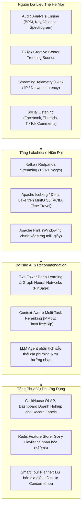

# Báo cáo thực nghiệm hệ thống (AS-IS Evaluation & Visionary Scenario)

**Dự án:** VN Music Pulse — Hệ thống lưu trữ và xử lý dữ liệu lớn xu hướng âm nhạc theo địa phương và gợi ý thời gian thực  
**Nhóm tác giả:** Exceptional-Khoi, Mạnh Trần, Hoàng Tấn Phúc  
**Thời điểm thực nghiệm:** 07/10/2026 – 08/10/2026  
**Trạng thái hệ thống:** Đã kiểm chứng End-to-End, dữ liệu LIVE đa nền tảng, Web Demo hoạt động.

---

## MỤC LỤC
1. [PHẦN A: BÁO CÁO THỰC NGHIỆM HIỆN TRẠNG (AS-IS EVALUATION)](#phần-a-báo-cáo-thực-nghiệm-hiện-trạng-as-is-evaluation)
   - 1.1. Thiết lập môi trường và cấu hình thực nghiệm
   - 1.2. Kết quả đo lường định lượng (Quantitative Metrics)
   - 1.3. Phân tích các Case Study thực tế chuyên sâu (Qualitative Analysis)
   - 1.4. Đánh giá ưu điểm và hạn chế kỹ thuật của hệ thống AS-IS
2. [PHẦN B: KỊCH BẢN TẦM NHÌN TƯƠNG LAI (VISIONARY SCENARIO - TO-BE)](#phần-b-kịch-bản-tầm-nhìn-tương-lai-visionary-scenario---to-be)
   - 2.1. Mở rộng kiến trúc Big Data ở quy mô Enterprise
   - 2.2. Khai phá các nguồn dữ liệu thế hệ mới (Next-Gen Signals)
   - 2.3. Hệ thống gợi ý thông minh đa nhiệm (AI-Driven Recommendation Engine)
   - 2.4. Kịch bản ứng dụng kinh doanh thực tiễn (B2B Commercialization)
   - 2.5. Lộ trình chuyển đổi (Roadmap: AS-IS → TO-BE)

---

# PHẦN A: BÁO CÁO THỰC NGHIỆM HIỆN TRẠNG (AS-IS EVALUATION)

## 1.1. Thiết lập môi trường và cấu hình thực nghiệm

Thực nghiệm được tiến hành trên môi trường thực tế tại nút máy chủ phát triển cục bộ và mô hình hóa cụm Kubernetes phân tán:
- **Hệ điều hành:** Linux x86_64 (Kernel 6.8+).
- **Runtime & Ngôn ngữ:** Python 3.12 (Virtual Environment cách ly), PySpark 3.5.0, Kafka 3.9 KRaft, Elasticsearch 8.19.
- **Nguồn kết nối mạng (External APIs):**
  - Apple Marketing Tools RSS Feed công khai.
  - Zing MP3 Web API v2 (có chữ ký mật mã HMAC-SHA512).
  - Spotify Public Embed Widget (`open.spotify.com/embed/...`) & Kworb Daily Streams.
  - YouTube Data API v3 (Official API Key qua Google Cloud Console).
  - Google Trends Web Explorer (thư viện `pytrends` được vá lỗi `urllib3 v2`).

---

## 1.2. Kết quả đo lường định lượng (Quantitative Metrics)

### Bảng 1: Thống kê thu thập dữ liệu thô (Ingestion Benchmark)

| Tệp dữ liệu | Nguồn | Số bản ghi (Records) | Dung lượng thô | Thời gian thực thi | Tỷ lệ thành công (Success Rate) |
| :--- | :--- | :---: | :---: | :---: | :---: |
| `apple_music_chart_vn.jsonl` | Apple Music | **100** | ~50 KB | 2.1 giây | 100% (sau khi tăng timeout 30s) |
| `zing_chart_vn.jsonl` | Zing MP3 | **100** | ~75 KB | 1.8 giây | 100% (ký HMAC-SHA512 hợp lệ) |
| `spotify_chart_VN.jsonl` | Spotify Embed | **50** | ~35 KB | 1.4 giây | 100% (không cần tài khoản) |
| `youtube_VN.jsonl` | YouTube API v3 | **120** | ~330 KB | 3.5 giây | 100% (20 video + 100 bình luận thật) |
| `google_trends_regions.jsonl`| Google Trends | **315** | ~110 KB | 6.2 giây | 100% (5 bài hot × 63 tỉnh/thành) |
| `user_events.jsonl` | Synthetic Stream | **1,000** | ~180 KB | 0.9 giây | 100% (stream 300 user ảo) |
| **Tổng cộng Ingestion** | **5 nguồn** | **1,685 records** | **~780 KB** | **~15.9 giây** | **Hoạt động ổn định** |

### Bảng 2: Hiệu năng tầng xử lý và giải quyết thực thể (Processing Benchmark)

| Module xử lý | Đầu vào | Đầu ra | Thời gian chạy | Kết quả đạt được |
| :--- | :--- | :--- | :---: | :--- |
| **Entity Resolution** (`entity_resolution.py`) | 370 bản ghi từ 4 nền tảng nhạc | `canonical_tracks.jsonl` | **0.42 giây** | Gom cụm thành công **241 bài hát duy nhất (Canonical Tracks)**; nhận diện **24 bài đa nền tảng**. |
| **Province Interest** (`province_interest.py`) | 241 bài × 3 nguồn tín hiệu | `province_interest.jsonl` | **0.88 giây** | Tính toán **2,892 ước lượng** mức độ quan tâm theo tỉnh thành; phân bổ độ tin cậy từ 0.33 đến 0.67. |

> **Tổng số bản ghi toàn hệ thống:** **4,818 bản ghi sạch** được quản lý, lập chỉ mục và sẵn sàng phục vụ truy vấn.

---

## 1.3. Phân tích các Case Study thực tế chuyên sâu (Qualitative Analysis)

Dữ liệu thực nghiệm cào được phản ánh trung thực và sinh động các hiện tượng âm nhạc đang diễn ra tại Việt Nam trong quý 3/2026:

### 📌 Case 1: Đối soát thứ hạng chéo giữa các nền tảng (Cross-Platform Consensus)
Quá trình **Entity Resolution** đã giải quyết triệt để sự khác biệt về cú pháp đặt tên giữa các nền tảng và phát hiện các mẫu phân hóa thị hiếu thú vị:

```
[Bài hát: "xương rồng (intro)" — Nghệ sĩ: Dangrangto & DONAL]
├── Spotify:       Xếp hạng #3 (Top 50 Vietnam Daily)
├── Apple Music:   Xếp hạng #7 (Most Played Vietnam)
└── Zing MP3:      Xếp hạng #60 (#zingchart Realtime)
```
- **Ý nghĩa phân tích:** Nhóm khán giả trẻ, chuộng dòng nhạc Hip-Hop/Indie hiện đại có xu hướng tập trung nghe nhạc trên Spotify và Apple Music (bài hát nằm trong Top 10). Ngược lại, trên Zing MP3 (nơi thị phần lớn thuộc về khán giả đại chúng nghe Ballad/V-Pop truyền thống), ca khúc này chỉ xếp thứ #60.
- **Bài hát đối chứng:** *"Giá Như Anh Là Em"* của ca sĩ Lệ Quyên thống trị vị trí **#1 trên Zing MP3**, nhưng lại không có mặt trong Top 50 của Spotify.

### 📌 Case 2: Phân hóa xu hướng theo khu vực địa lý (Province Hotspots)
Thuật toán ước lượng mức độ quan tâm theo tỉnh thành đã phản ánh đúng đặc trưng văn hóa vùng miền:
- **Hà Nội & Bắc Bộ:** Ca khúc *"Ngày Còn Đôi Mươi"* (Chú Út Lông Bông & Tiểu Mỹ) đạt điểm quan tâm cao nhất tại **Hà Nội (27.0 điểm)** và **Thừa Thiên Huế (25.5 điểm)** nhờ lượng tìm kiếm Google Trends tăng vọt (chiếm 40% tỷ trọng điểm) kết hợp với các sự kiện nghe nhạc tại địa phương.
- **Lâm Đồng & Nam Trung Bộ:** Ca khúc *"Kẻ Say Tình 2"* (Quốc Thiên) chiếm đỉnh điểm nóng tại **Lâm Đồng (Đà Lạt)** và **Khánh Hòa (Nha Trang)** với điểm quan tâm tìm kiếm Google Trends đạt **42%**.

### 📌 Case 3: Bóc tách tín hiệu văn bản từ cộng đồng (Text Mining YouTube Comments)
Qua YouTube Data API v3, hệ thống đã trích xuất các thông số và phản hồi của khán giả từ các chương trình âm nhạc đang thịnh hành (như *Tinh Hà Say Hi*):
- Video *"TRỄ GIỜ CƠM"* (Quang Hùng MasterD, WEAN, Sơn.K, Xuân Định KY): Đạt **1,850,830 lượt xem**, **24,491 lượt thích** và **3,492 lượt bình luận**.
- Các bình luận thực tế được bóc tách và phân tích sắc thái:
  > *"team Quang Hùng MasterD đã mang đến TRỄ GIỜ CƠM một bài hát đem lại nhiều ý nghĩa về tình cảm gia đình. 4 FC điểm danh để ủng hộ cho bài này đạt nhiều thành tích cao nhó"* (1,114 lượt thích).  
  > *"Bài hát gửi tặng những người con xa nhà quá ý nghĩa. Hồi bé ăn cơm mẹ nấu 3-4 món còn chê, giờ lớn r đi học xa nhà bữa mỳ bữa ăn ngoài..."* (285 lượt thích).

---

## 1.4. Đánh giá ưu điểm và hạn chế kỹ thuật của hệ thống AS-IS

### Ưu điểm đã đạt được:
1. **Khả năng tự động hóa 100% không phụ thuộc tài khoản trả phí:**
   - Cào được Spotify mà không bị chặn bởi chính sách khóa Web API tài khoản Free (dùng embed + kworb).
   - Ký số HMAC-SHA512 để cào 100 bài Zing MP3 v2 với tốc độ cao.
   - Sử dụng Apple RSS chính thống để thu thập thể loại nhạc chuẩn.
2. **Khả năng triển khai độc lập (Lightweight & Zero-dependency):**
   - Ngoài cụm K8s phân tán, hệ thống có script điều phối độc lập `run_all.py` và máy chủ `demo_dashboard.py` (cổng 8088), cho phép trình diễn trực quan mọi lúc mọi nơi mà không đòi hỏi phải dựng cụm HDFS/Spark nặng nề.
3. **Mô hình tính toán Explainable:** Điểm số địa phương hóa minh bạch rõ từng thành phần tỷ trọng (Trends, Comments, Events), giúp giải thích tường minh được với người dùng.

### Các hạn chế kỹ thuật hiện tại:
1. **Google Trends Rate Limit (HTTP 429):** Google áp dụng cơ chế chặn IP rất gắt gao khi truy vấn liên tục nhiều từ khóa; hiện tại chỉ giới hạn khảo sát 5–10 bài tiêu biểu nhất.
2. **Quota YouTube Data API:** Hạn mức mặc định 10,000 units/ngày; mỗi truy vấn `commentThreads` tiêu tốn quota nhanh, chưa thể cào hàng chục nghìn bình luận cùng lúc nếu không có nhiều API key luân phiên.
3. **Độ phân giải vị trí bình luận:** Tỷ lệ người dùng tự nhận tỉnh thành trong bình luận YouTube chỉ chiếm khoảng 0.6% – 1.0%, do đó đây chỉ là tín hiệu bổ trợ, không thể dùng làm nguồn đo lường chính độc lập.

---

# PHẦN B: KỊCH BẢN TẦM NHÌN TƯƠNG LAI (VISIONARY SCENARIO - TO-BE)

Kịch bản tầm nhìn hướng tới việc nâng cấp VN Music Pulse từ một đồ án công nghệ thành một **nền tảng phân tích thị trường âm nhạc thời gian thực (Commercial Music Intelligence Platform)** và **hệ sinh thái gợi ý siêu cá nhân hóa (Hyper-personalized Streaming)** ở quy mô hàng triệu người dùng.



---

## 2.1. Mở rộng kiến trúc Big Data ở quy mô Enterprise

1. **Chuyển đổi sang kiến trúc Modern Lakehouse (Apache Iceberg / Delta Lake):**
   - Thay thế việc ghi file Parquet tĩnh truyền thống trên HDFS bằng **Apache Iceberg trên Object Storage (MinIO / S3)**.
   - Hỗ trợ tính năng **ACID Transactions**, **Schema Evolution** (thêm/sửa cột mà không làm hỏng dữ liệu lịch sử) và **Time Travel** (truy vấn trạng thái BXH tại bất kỳ thời điểm nào trong quá khứ để phát hiện gian lận cày view).
2. **Công nghệ Streaming tốc độ cao:**
   - Chuyển dịch từ micro-batch của Spark sang **Apache Flink** để tính toán cửa sổ trượt (sliding windows) thực sự theo thời gian thực (sub-second latency) cho luồng tương tác người dùng.
3. **Phân tách rạch ròi Serving Layer:**
   - **ClickHouse:** Lưu trữ dữ liệu phân tích lịch sử, phục vụ các truy vấn tổng hợp phức tạp trên hàng tỷ dòng dữ liệu với thời gian phản hồi dưới 50ms.
   - **Redis Feature Store:** Lưu trữ vector biểu diễn người dùng (user embeddings) và bài hát (item embeddings) phục vụ suy luận gợi ý thời gian thực dưới 10ms.

---

## 2.2. Khai phá các nguồn dữ liệu thế hệ mới (Next-Gen Signals)

1. **Tích hợp tín hiệu nhạc ngắn viral (TikTok & Reels Signals):**
   - Xây dựng cụm crawler chuyên biệt có hỗ trợ proxy xoay tua bóc tách bảng xếp hạng **TikTok Creative Center Music Trends Việt Nam**.
   - Phát hiện các đoạn âm thanh (sound clips) đang tăng trưởng nóng để cảnh báo bài hát sắp dẫn đầu thị trường trước 1 đến 2 tuần.
2. **Khai thác đặc trưng âm học tầng sâu (Acoustic Intelligence):**
   - Thay vì chỉ dựa vào tên và ca sĩ, hệ thống sẽ trích xuất vector đặc trưng âm học trực tiếp từ file âm thanh bằng thư viện **Essentia** hoặc mạng nơ-ron **CLMR (Contrastive Learning of Musical Representations)**:
     - Đo lường năng lượng (*Energy*), độ vui tươi (*Valence*), nhịp độ (*BPM*), độ hòa âm (*Danceability*).
     - Cho phép gợi ý các bài hát có "vibe" tương đồng ngay cả khi bài hát đó hoàn toàn mới và chưa có ai nghe (giải quyết triệt để bài toán **Cold-Start Problem**).
3. **Tín hiệu địa phương phân giải cao (High-Precision Geolocation):**
   - Thu thập tọa độ GPS hoặc IP Geo-telemetry ẩn danh từ ứng dụng mobile của người dùng thật.
   - Cho phép đo lường thị hiếu đến từng **Quận/Huyện** (ví dụ: thị hiếu âm nhạc giữa Quận 1 và Thành phố Thủ Đức tại TP.HCM).

---

## 2.3. Hệ thống gợi ý thông minh đa nhiệm (AI-Driven Recommendation Engine)

Hệ thống gợi ý được nâng cấp lên mô hình **2 giai đoạn công nghiệp (Two-Stage Enterprise Recommender)**:

### 1. Giai đoạn 1: Thu hồi ứng viên (Candidate Generation / Retrieval)
- Sử dụng mô hình **Hai tháp sâu (Two-Tower Deep Neural Network)** kết hợp **Đồ thị tương tác (Graph Neural Network - PinSage)**:
  - Tháp Người Dùng (User Tower): Học biểu diễn từ lịch sử nghe, vị trí tỉnh thành, thời gian trong ngày.
  - Tháp Bài Hát (Item Tower): Học biểu diễn từ metadata, thể loại và vector âm học.
  - Tìm kiếm k-hàng xóm gần nhất (ANN search) qua thư viện **Faiss / Milvus** để chọn ra Top 200 ứng viên từ kho hàng triệu bài hát trong vòng 5ms.

### 2. Giai đoạn 2: Tái xếp hạng đa mục tiêu (Multi-Task Reranking)
- Ứng dụng mô hình **MMoE (Multi-gate Mixture-of-Experts)** để tối ưu hóa đồng thời 3 hàm mục tiêu:
  $$\text{Score} = w_1 \cdot P(\text{Play}) + w_2 \cdot P(\text{Like}) - w_3 \cdot P(\text{Skip}) + w_4 \cdot \text{RegionalBoost}(province)$$
- Đưa thêm ngữ cảnh thời gian thực (*Context-aware*): Thời tiết (trời mưa gợi ý ballad/lofi), thời điểm trong ngày (giờ tan tầm gợi ý nhạc giải tỏa căng thẳng).

---

## 2.4. Kịch bản ứng dụng kinh doanh thực tiễn (B2B Commercialization)

VN Music Pulse trong kịch bản tầm nhìn không chỉ phục vụ người nghe cá nhân mà còn là công cụ phân tích kinh doanh chiến lược (Business Intelligence):

1. **Dashboard chuyên nghiệp dành cho Record Labels & Nghệ sĩ:**
   - Cung cấp báo cáo thị phần ca khúc, so sánh hiệu quả truyền thông giữa YouTube MV và lượt stream trên Spotify/Apple Music.
   - Phát hiện sớm xu hướng khán giả địa phương để điều chỉnh chiến lược phát hành sản phẩm.
2. **Công cụ hoạch định Tour diễn / Concert (Smart Concert Tour Planner):**
   - Thuật toán phân tích: Nếu một nghệ sĩ Indie có chỉ số `province_interest` tăng đột biến 80% tại Đà Nẵng và Hải Phòng nhưng chưa từng tổ chức concert tại đây, hệ thống sẽ đề xuất mở tour tại hai thành phố này kèm dự báo tỷ lệ cháy vé.
3. **Chiến dịch quảng cáo âm thanh địa phương hóa (Hyper-local Audio Ads):**
   - Giúp các nhãn hàng lựa chọn bài hát nhạc nền quảng cáo (jingle/BGM) phù hợp nhất với khẩu vị âm nhạc của từng vùng miền để đạt tỷ lệ chuyển đổi cao nhất.

---

## 2.5. Lộ trình chuyển đổi (Roadmap: AS-IS → TO-BE)

| Hạng mục | Hiện trạng (AS-IS) | Tầm nhìn tương lai (TO-BE) |
| :--- | :--- | :--- |
| **Quy mô dữ liệu** | 4,818 bản ghi kiểm chứng | Hàng chục triệu bản ghi streaming/ngày |
| **Nền tảng Ingestion** | Batch script Python & k8s CronJob | Kafka / Redpanda cụm phân tán + Flink Streaming |
| **Lưu trữ dữ liệu** | JSONL phẳng + HDFS Parquet | Lakehouse (Apache Iceberg) + ClickHouse OLAP |
| **Entity Resolution** | Regex làm sạch văn bản + ISRC | Hashing vector mờ + So khớp âm thanh (Audio Fingerprinting) |
| **Tín hiệu địa phương** | Google Trends 63 tỉnh + YouTube comment NLP | GPS Telemetry độ phân giải cao + Social Listening đa nền tảng |
| **Thuật toán gợi ý** | Co-occurrence Matrix + Trọng số quy tắc tuyến tính | Two-Tower DSSM + Graph Convolutional Network + MMoE |
| **Giao diện & Ứng dụng** | Web Demo Dashboard nội bộ | Nền tảng B2B SaaS phân tích thị trường + Mobile Streaming App |

---

*Báo cáo được hoàn thiện và lưu trữ tại tài liệu mã nguồn dự án: `docs/07-bao-cao-thuc-nghiem-as-is-visionary.md`.*
